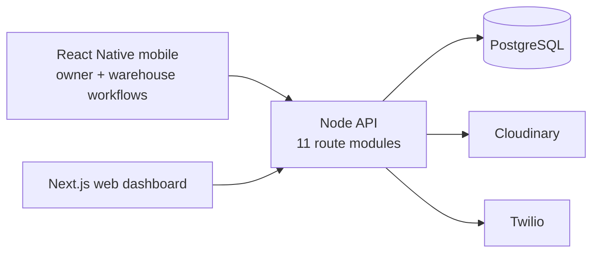

# TileHub Pro — Full-Stack Tile Operations Platform

TileHub combines a React Native field app, a Next.js web dashboard, and a
Node/PostgreSQL API for tile inventory, billing, orders, customers, analytics,
and QR-driven warehouse dispatch.


[Configured web deployment](https://tile-hub.vercel.app)

## At a glance

| Verified from the repository tree | Count |
| --- | ---: |
| Application surfaces: mobile, web, API | **3** |
| React Native screens | **18** |
| Web route pages | **17** |
| Backend route modules | **11** |
| Backend controllers | **6** |

## Architecture preview



> **Repository status:** generated dependency folders and the React Native debug
> keystore are excluded from the current source tree. Production signing keys
> and environment secrets must never be committed.

## Quick start

### Mobile app

```bash
git clone https://github.com/Sriman-Kunda-056/TileHub.git
cd TileHub
npm install
npm start

# In another terminal
npm run android
```

For iOS on macOS, install Pods in `ios/` and run `npm run ios`.

### Backend API

```bash
cd backend
npm install
node server.js
```

### Web dashboard

```bash
cd frontend
npm install
npm run dev
```

Each surface has its own environment configuration. Use example files when
present and keep JWT, Cloudinary, Twilio, database, and deployment credentials
out of Git.

---

## API URL Configuration

Edit `src/services/api.js` line 3:

```js
// Android Emulator → your PC's localhost
export const API_BASE = 'http://10.0.2.2:5000/api';

// Real Android/iOS device → your PC's IP
export const API_BASE = 'http://192.168.1.XXX:5000/api';

// Production
export const API_BASE = 'https://tilehub-api.onrender.com/api';
```

---

## Features by Role

### Owner / Admin
- Dashboard with KPIs (revenue, orders, alerts)
- **Create Bill** — 3-step wizard: customer → items → confirm
  - Auto-creates order + confirms + reserves stock + generates shipment QR
- Billing — all invoices, payment status, record payments
- Inventory — live stock, restock, critical alerts
- Orders — confirm draft → auto-shipment

### Warehouse Worker
- Shipments — pending / dispatched / delivered tabs
- **QR Scanner** — live camera scan → auto dispatch → stock deducted
- Mark delivered with one tap

### All roles
- Role-based login with demo fill button
- Secure session via AsyncStorage (persists across app restarts)
- Sign up screen for new users

---

## Key Dependency Notes

`react-native-camera-kit` requires:
- Android: minSdkVersion 24 in `android/build.gradle`
- iOS: Camera permission in `Info.plist`

Add to `android/app/src/main/AndroidManifest.xml`:
```xml
<uses-permission android:name="android.permission.CAMERA" />
```

Add to `ios/TileHubPro/Info.plist`:
```xml
<key>NSCameraUsageDescription</key>
<string>TileHub Pro needs camera access to scan shipment QR codes</string>
```
